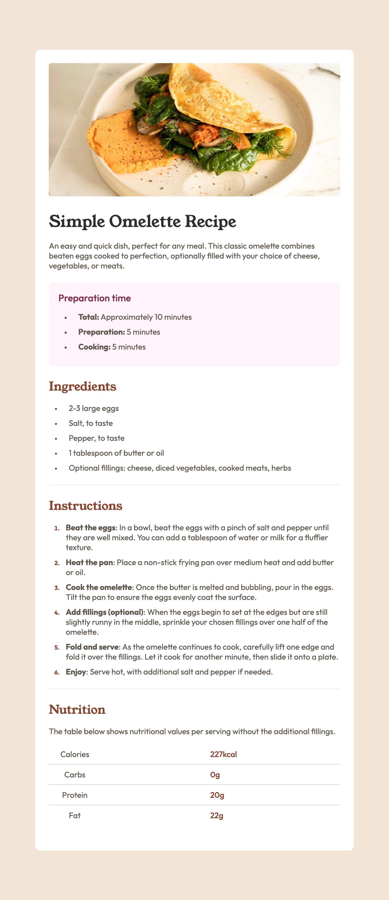

# Frontend Mentor - Recipe page solution

This is a solution to the [Recipe page challenge on Frontend Mentor](https://www.frontendmentor.io/challenges/recipe-page-KiTsR8QQKm). Frontend Mentor challenges help you improve your coding skills by building realistic projects.

## Table of contents

- [Overview](#overview)
  - [The challenge](#the-challenge)
  - [Screenshot](#screenshot)
  - [Links](#links)
- [My process](#my-process)

  - [Built with](#built-with)

- [Author](#author)

## Overview

### Screenshot

### Links

- Solution URL: [Add solution URL here](http://127.0.0.1:5500/)
- Live Site URL: [Add live site URL here](https://recipe-page-main-psi-beryl.vercel.app/)

## My process

### Built with

- Semantic HTML5 markup
- Flexbox
- CSS Grid
- bem methodology

## Author

- Website - [MohammedK](https://recipe-page-main-psi-beryl.vercel.app/)
- Frontend Mentor - [@MohammadAli-K](https://www.frontendmentor.io/profile/yourusername)

# Recipe-page-main
